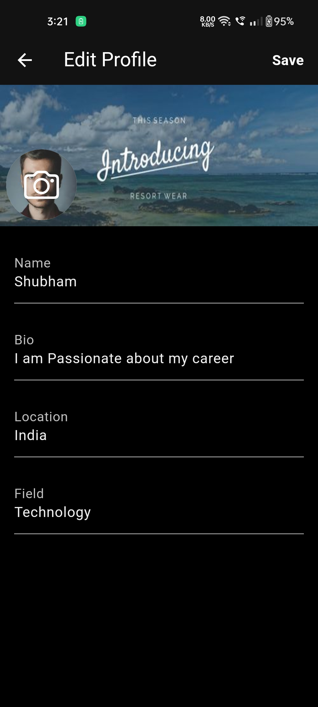

# social_app

## Table of contents

  - [Screenshot](#screenshot)
  - [Description](#description)
  - [Built with](#built-with)
  - [What I learned](#what-i-learned)
  - [Author](#author)

### Screenshot
 
 
 
 

## Description

A Social App which is similar to X(Twitter) which has features like User's Authentication and an Full- Fledged Backend. The user can Post, Reply, Like - Comment - Bookmark and interact with other users. The user can also switch between Light & Dark mode which enhances the user's experience.

The user can edit his profile and enter details like Bio, Location, Field(He works in or Interested in)

### Built with

- Flutter
- Cloud Firestore
- Provider(State Management)
- Firebase Authentication

### What I learned
I learned how to handle large amount of data from cloud firestore like the users personal information, their Posts & Replies, etc.
It was challenging to work with Provider and handle the states but after using it for some time, finally understood it.

## Author
- LinkedIn - [Sahil Bansal] (https://www.linkedin.com/in/%F0%9F%8E%AF-sahil-bansal-882b41272/)
- Twitter - [@Sahil121315](https://x.com/Sahil121315?t=91yHYBDE2vjBnehGdAjZ0Q&s=09)
